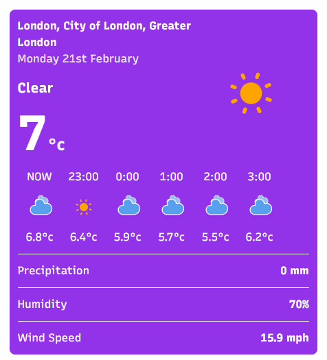

# Weatherly
A weather dashboard that gives you the current & next 5 days weather forecast - built in React and a sprinkling of Tailwind CSS.

To get this going, you'll need to generate an API key from: https://www.weatherapi.com

### How does it work?
Using the GeoLocation Browser API, it will get your Lat & Long for the device you're viewing from. The free WeatherAPI is used to get the forecast & this is then formatted and made pretty!

### How do I get it working?

```
git clone git@github.com:stuartajd/weatherly.git
cd weatherly
npm install
cp example.config.jsx config.jsx
npm run dev
```

### Can I suggest things?
Yes!

### What does it look like?
